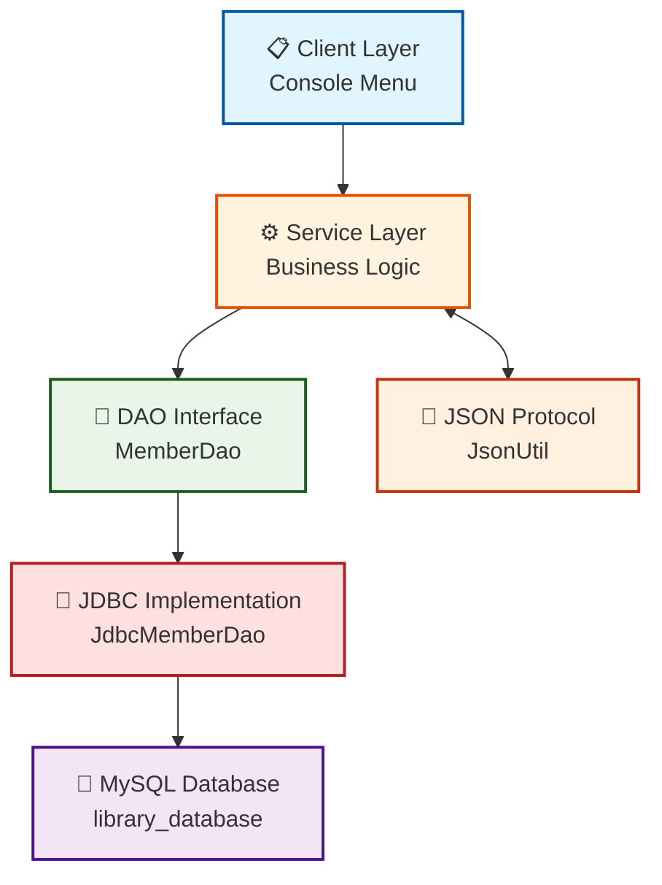

# 📚 Library Management System - Stage 1

## 👥 Group Members
- **Abdihafid Gahayr** (D00283863)
- **Ali Jabril** (D00283862)

---

## 🏗️ How Our System is Built (Architecture)



### 📖 What Each Part Does (Simple Explanation)

| Part | What It Does | Where to Find It |
|------|--------------|------------------|
| **Client Layer** | The menu you see when you run the program. You type numbers (1-7) to choose what you want to do. | `Main.java` (lines 25-42) |
| **Service Layer** | The brain of the system. It decides what should happen when you pick an option. | `Main.java` methods like `GetAllMembers()`, `InsertMember()` |
| **DAO Interface** | A list that says what operations are possible (like findAll, findById, etc.). | `MemberDao.java` |
| **JDBC Implementation** | The actual code that operates to the database. It runs SQL queries using PreparedStatement. | `JdbcMemberDao.java` |
| **Database** | Where all the data is stored (MySQL). Has tables like `member`, `book`, etc. | `library_database` in phpMyAdmin |
| **JSON Protocol** | Converts Java objects into JSON format (and back). Used for data exchange. | `JsonUtil.java` |

---

## 🎯 How Data Flows Through the System

When you choose an option from the menu, here's what happens:

1. **You pick option 1** (Get All Members)
2. **The Service Layer** calls `memberDao.findAll()`
3. **The DAO Interface** passes the request to `JdbcMemberDao`
4. **JDBC Implementation** runs: `SELECT * FROM member`
5. **Database** sends back the data
6. **The data goes back up** the chain to your screen

When you use JSON (option 6):
- Java objects → JSON (to send data out)
- JSON → Java objects (to read data in)

---

## ✅ Features You Can Test in the Menu

| Menu Option | Feature | What It Does |
|-------------|---------|--------------|
| **1** | F3: Get All Members | Shows every member in the database |
| **2** | F4: Get Member by ID | Finds one member using their ID |
| **3** | F6: Insert Member | Adds a new member (ID is auto-generated) |
| **4** | F7: Update Member | Changes a member's details |
| **5** | F8: Filter with Predicate | Finds members that match a rule (e.g., name starts with 'A') |
| **6** | F9: JSON Conversion | Converts members to/from JSON |
| **7** | F5: Delete Member | Removes a member from the database |
| **0** | Exit | Closes the program |

---

## 🗄️ Database Tables

| Table | What It Stores |
|-------|----------------|
| **member** | People who borrow books (id, name, address, phone) |
| **book** | Books in the library (id, title, author, etc.) |
| **category** | Types of books (Fiction, Science, etc.) |
| **shelf** | Where books are located in the library |
| **staff** | People who work at the library |

---

## 🛠️ How to Run the Program

1. **Start XAMPP** and make sure MySQL is running
2. **Import the database**: Open phpMyAdmin and run `sql/create_db.sql`
3. **Run the program**: In IntelliJ, click the green triangle on `Main.java`
4. **Follow the menu**: Type numbers 1-7 to test each feature

---

## 📁 Project Files

```
src/main/java/com/library/
├── Main.java              # The menu program you run
├── dao/                   # Interfaces (to-do lists)
│   └── MemberDao.java
├── jdbc/                   # Actual database code
│   └── JdbcMemberDao.java
├── domain/                 # Data objects
│   └── Member.java
├── db/                     # Database connection
│   └── DatabaseConnection.java
└── json/                   # JSON converter
    └── JsonUtil.java
```

## 🔗 GitHub Repository
[https://github.com/AliJay2025/CA2-Library-DAO](https://github.com/AliJay2025/CA2-Library-DAO)

---

