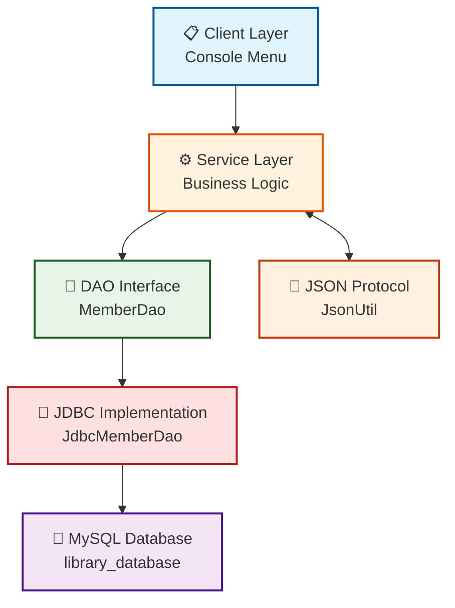

# 📚 Library Management System - Stage 1

## 👥 Group Members
- **Abdihafid Gahayr** (Student ID: D00283863)
- **Ali Jabril** (Student ID: D00283862)

---

## 🏗️ Architecture Diagram



### 📊 Diagram Explanation
- **Client Layer**: Console-based user interface where users interact
- **Service Layer**: Contains business logic and rules
- **DAO Interface**: Contract for database operations
- **JDBC Implementation**: Actual SQL code using PreparedStatement
- **Database**: MySQL database with 5 tables
- **JSON Protocol**: Converts Java objects to/from JSON format

---

## ✅ Features Completed (F1-F9)

| Feature | Description | Status |
|---------|-------------|--------|
| **F1** | Entity & Database Setup | ✅ 5 DTOs, 10+ seed rows |
| **F2** | DAO Interface & JDBC Implementation | ✅ Interfaces + Implementations |
| **F3** | Get All Entities | ✅ `findAll()` returns List |
| **F4** | Get by ID | ✅ Returns `Optional`, never null |
| **F5** | Delete by ID | ✅ Returns boolean |
| **F6** | Insert Entity | ✅ Auto-generated ID via `getGeneratedKeys()` |
| **F7** | Update Entity | ✅ Returns updated DTO |
| **F8** | Filter with Predicate | ✅ Lambda filtering |
| **F9** | JSON Conversion | ✅ Round-trip verified |

---

## 🗄️ Database Tables

| Table | Description |
|-------|-------------|
| **member** | Library members (id, name, address, phone) |
| **book** | Books in library (id, title, author, category_id, shelf_id, available_copies) |
| **category** | Book categories (id, name) |
| **shelf** | Physical shelf locations (id, shelf_number, location) |
| **staff** | Library employees (id, name, role, contact) |

---

## 🛠️ How to Run

### Prerequisites
- XAMPP (MySQL) installed and running
- IntelliJ IDEA
- Java 8

### Steps to Run

1. **Start MySQL** in XAMPP Control Panel

2. **Create Database** 
   - Open phpMyAdmin: http://localhost/phpmyadmin
   - Import `sql/create_db.sql`

3. **Open Project** in IntelliJ

4. **Run Main Class**
   - Navigate to `com.library.Main`
   - Click the green triangle ▶️ to run

---

## 📁 Project Structure

```
src/main/java/com/library/
├── Main.java                    # Demo application
├── dao/                         # DAO Interfaces
│   ├── MemberDao.java
│   ├── BookDao.java
│   ├── CategoryDao.java
│   ├── ShelfDao.java
│   └── StaffDao.java
├── jdbc/                        # JDBC Implementations
│   ├── JdbcMemberDao.java
│   ├── JdbcBookDao.java
│   ├── JdbcCategoryDao.java
│   ├── JdbcShelfDao.java
│   └── JdbcStaffDao.java
├── domain/                      # DTO Classes
│   ├── Member.java
│   ├── Book.java
│   ├── Category.java
│   ├── Shelf.java
│   └── Staff.java
├── db/                          # Database Connection
│   └── DatabaseConnection.java
└── json/                        # JSON Conversion
    └── JsonUtil.java
```

---

## 🔧 Technologies Used

- **Java 8** - Core language
- **MySQL** - Database
- **JDBC** - Database connectivity
- **Maven** - Dependency management
- **Jackson** - JSON processing
- **JUnit** - Testing

---

## 📸 Expected Output

When you run `Main.java`, you should see:

```
-----------------------------------------------
  DAO Layer and Full CRUD - STAGE 1
------------------------------------------------

--- F3: GET ALL MEMBERS ---
   Total members found: 10
   - Member{id=1, name='Ali Abdi', phone='087-123-4567'}
   ...

--- F4: GET MEMBER BY ID ---
   Found member with ID 1: Member{id=1, name='Ali Abdi', phone='087-123-4567'}

--- F6: INSERT MEMBER ---
   After insert - ID: 11 (auto-generated) ✓

--- F7: UPDATE MEMBER ---
   Update result: SUCCESS ✓

--- F8: FILTER WITH PREDICATE ---
   Members with names starting with 'A': 2

--- F9: JSON CONVERSION ---
   Member to JSON: {"id":1,"name":"Ali Abdi","address":"123 Main St, Dublin","phone":"087-123-4567"}

--- F5: DELETE MEMBER ---
   Delete result: SUCCESS ✓
```

---

## 🔗 GitHub Repository
[https://github.com/AliJay2025/CA2-Library-DAO](https://github.com/AliJay2025/CA2-Library-DAO)

---

## 📅 Deadline
Sunday 8th March - Stage 1 Complete ✅