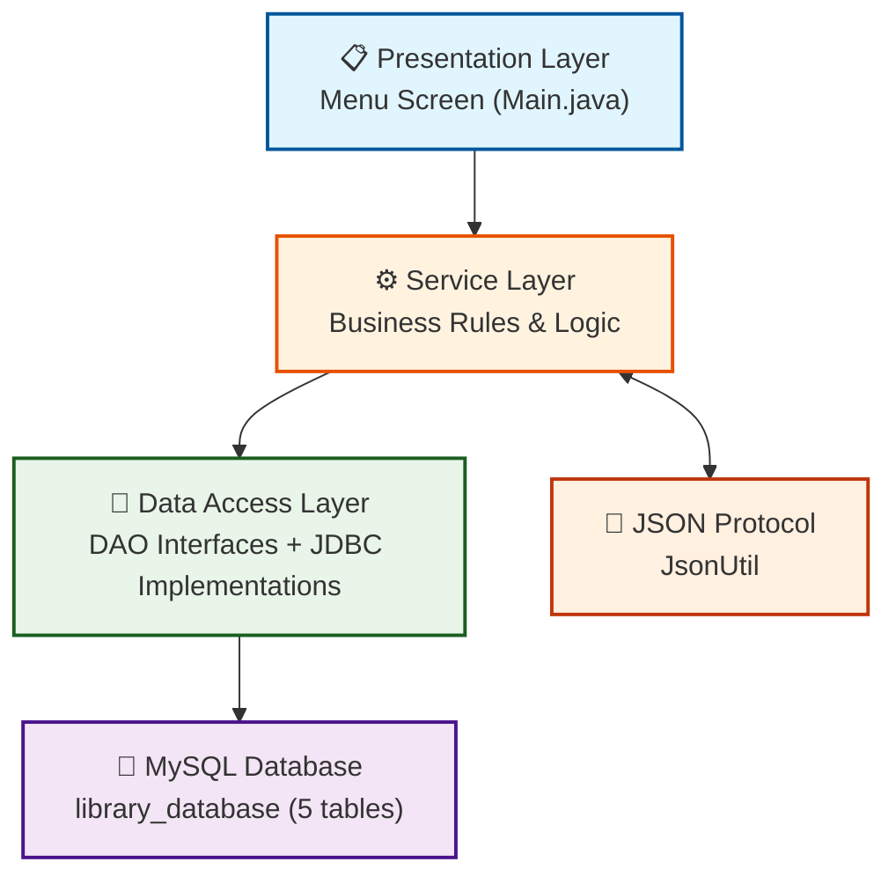

# 📚 Library Management System - Stage 1 & 2

## 👥 Group Members
- **Abdihafid Gahayr** (D00283863)
- **Ali Jabril** (D00283862)

---

## 🏗️ System Architecture


```mermaid
graph TD
  UI["📋 Presentation Layer<br/>Menu Screen (Main.java)"] --> S["⚙️ Service Layer<br/>Business Rules & Logic"]
  S --> D["📄 Data Access Layer<br/>DAO Interfaces + JDBC Implementations"]
  D --> DB["💾 MySQL Database<br/>library_database (5 tables)"]
  
  S <--> JSON["🔄 JSON Protocol<br/>JsonUtil"]

  style UI fill:#e1f5fe,stroke:#01579b,stroke-width:2px
  style S fill:#fff3e0,stroke:#e65100,stroke-width:2px
  style D fill:#e8f5e8,stroke:#1b5e20,stroke-width:2px
  style DB fill:#f3e5f5,stroke:#4a148c,stroke-width:2px
  style JSON fill:#fff0e0,stroke:#bf360c,stroke-width:2px
```

### 📖 What Each Layer Does

| Layer | What It Contains | Simple Explanation |
|-------|------------------|-------------------|
| **Presentation Layer** | `Main.java` | The menu you see when you run the program. You type numbers 1-7. |
| **Service Layer** | Methods in `Main.java` | The brain - decides what happens when you pick an option. |
| **Data Access Layer** | `dao/` + `jdbc/` folders | 5 DAO interfaces + 5 JDBC implementations that talk to the database. |
| **Database** | `library_database` | MySQL with 5 tables: member, book, category, shelf, staff. |
| **JSON Protocol** | `JsonUtil.java` | Converts Java objects to/from JSON format. |

---

## ✅ Stage 1 Features (F1-F9)

| Menu Option | Feature | What It Does |
|-------------|---------|--------------|
| **1** | F3: Get All Members | Shows every member in the database |
| **2** | F4: Get Member by ID | Finds one member using their ID |
| **3** | F6: Insert Member | Adds a new member (ID is auto-generated) |
| **4** | F7: Update Member | Changes a member's details |
| **5** | F8: Filter with Predicate | Finds members that match a rule (e.g., name starts with 'A') |
| **6** | F9: JSON Conversion | Converts members to/from JSON |
| **7** | F5: Delete Member | Removes a member from the database |
| **0** | Exit | Closes the program |

---

## 🗄️ Database Tables

| Table | What It Stores |
|-------|----------------|
| **member** | People who borrow books (id, name, address, phone) |
| **book** | Books in the library (id, title, author, etc.) |
| **category** | Types of books (Fiction, Science, etc.) |
| **shelf** | Where books are located in the library |
| **staff** | People who work at the library |

---

## 🛠️ How to Run Stage 1

1. **Start XAMPP** and make sure MySQL is running
2. **Import the database**: Open phpMyAdmin and run `sql/create_db.sql`
3. **Run the program**: In IntelliJ, click the green triangle on `Main.java`
4. **Follow the menu**: Type numbers 1-7 to test each feature

---

## 📁 Project Structure

```
src/main/java/com/library/
├── Main.java              # Stage 1 menu program
├── dao/                   # DAO Interfaces
│   ├── MemberDao.java
│   ├── BookDao.java
│   ├── CategoryDao.java
│   ├── ShelfDao.java
│   └── StaffDao.java
├── jdbc/                  # JDBC Implementations
│   ├── JdbcMemberDao.java
│   ├── JdbcBookDao.java
│   ├── JdbcCategoryDao.java
│   ├── JdbcShelfDao.java
│   └── JdbcStaffDao.java
├── domain/                # Entity Classes
│   ├── Member.java
│   ├── Book.java
│   ├── Category.java
│   ├── Shelf.java
│   └── Staff.java
├── db/                    # Database Connection
│   └── DatabaseConnection.java
├── json/                  # JSON Conversion
│   └── JsonUtil.java
├── server/                # Stage 2 Server
│   └── LibraryServer.java
├── client/                # Stage 2 Client
│   └── LibraryClient.java
└── model/                 # Stage 2 Response Wrapper
    └── ServerResponse.java
```

---

# 📡 Stage 2: Client-Server Integration

## 🚀 Features (F10-F16)

| Feature | Description | Status |
|---------|-------------|--------|
| **F10** | Multithreaded Server | ✅ ExecutorService handles multiple clients |
| **F11** | ServerResponse Wrapper | ✅ Generic wrapper with status, message, data |
| **F12** | Get All & Get by ID | ✅ Client can retrieve members |
| **F13** | Insert Entity | ✅ Client can add new members |
| **F14** | Delete Entity | ✅ Client can delete members |
| **F15** | Update Entity | ✅ Client can update members |
| **F16** | Error Handling & Protocol | ✅ Structured errors + documentation |

---

## 📡 Client-Server Protocol

### Communication Overview

The client and server communicate using JSON messages over TCP sockets.  
All requests follow a standard format, and all responses use the `ServerResponse<T>` wrapper.

---

### 📨 Request Format

```json
{
  "requestType": "REQUEST_TYPE",
  "id": 1,
  "data": { ... }
}
```

| Field | Type | Description |
|-------|------|-------------|
| `requestType` | String | The operation to perform |
| `id` | Integer | Used for get/delete by ID |
| `data` | Object | Used for insert/update operations |

---

### 📬 Response Format

```json
{
  "status": "success",
  "message": "Operation completed",
  "data": { ... }
}
```

| Field | Type | Description |
|-------|------|-------------|
| `status` | String | `"success"` or `"error"` |
| `message` | String | Human-readable message |
| `data` | Object | The result data (Member, List, or null) |

---

### 📋 Request Types

| Request Type | Payload | Response Data |
|--------------|---------|---------------|
| **GET_ALL_MEMBERS** | `null` | `List<Member>` |
| **GET_MEMBER_BY_ID** | `{"id": 1}` | `Member` |
| **INSERT_MEMBER** | `{"data": {"name": "...", "address": "...", "phone": "..."}}` | `Member` (with auto-generated ID) |
| **UPDATE_MEMBER** | `{"data": {"id": 1, "name": "...", "address": "...", "phone": "..."}}` | `Member` (updated) |
| **DELETE_MEMBER** | `{"id": 1}` | `null` |

---

### 📤 Example Request & Response

#### Example 1: Get All Members

**Request:**
```json
{
  "requestType": "GET_ALL_MEMBERS"
}
```

**Response:**
```json
{
  "status": "success",
  "message": "Found 10 members",
  "data": [
    {"id": 1, "name": "Ali Abdi", "address": "123 Main St, Dublin", "phone": "087-123-4567"},
    {"id": 2, "name": "Mary Johnson", "address": "45 Oak Avenue, Dundalk", "phone": "086-234-5678"}
  ]
}
```

#### Example 2: Get Member by ID

**Request:**
```json
{
  "requestType": "GET_MEMBER_BY_ID",
  "id": 1
}
```

**Response:**
```json
{
  "status": "success",
  "message": "Member found",
  "data": {"id": 1, "name": "Ali Abdi", "address": "123 Main St, Dublin", "phone": "087-123-4567"}
}
```

#### Example 3: Insert Member

**Request:**
```json
{
  "requestType": "INSERT_MEMBER",
  "data": {
    "name": "John Doe",
    "address": "456 New St, Cork",
    "phone": "085-123-4567"
  }
}
```

**Response:**
```json
{
  "status": "success",
  "message": "Member inserted with ID 25",
  "data": {"id": 25, "name": "John Doe", "address": "456 New St, Cork", "phone": "085-123-4567"}
}
```

#### Example 4: Update Member

**Request:**
```json
{
  "requestType": "UPDATE_MEMBER",
  "data": {
    "id": 25,
    "name": "John Updated",
    "address": "789 Updated St",
    "phone": "085-999-8888"
  }
}
```

**Response:**
```json
{
  "status": "success",
  "message": "Member updated",
  "data": {"id": 25, "name": "John Updated", "address": "789 Updated St", "phone": "085-999-8888"}
}
```

#### Example 5: Delete Member

**Request:**
```json
{
  "requestType": "DELETE_MEMBER",
  "id": 25
}
```

**Response:**
```json
{
  "status": "success",
  "message": "Member deleted successfully",
  "data": null
}
```

---

### ❌ Error Response

When something goes wrong, the server returns an error response:

```json
{
  "status": "error",
  "message": "Member with ID 999 not found",
  "data": null
}
```

## 🛠️ How to Run Stage 2

1. **Start the Server first**  
   Run `LibraryServer.java` in IntelliJ.  
   You should see: `Server is running. Waiting for clients...`

2. **Start the Client(s)**  
   Run `LibraryClient.java` in a separate terminal/window.  
   You can run multiple clients simultaneously.

3. **Use the Menu**  
   Choose options 1-5 to test each CRUD operation:
   - 1: Get All Members
   - 2: Get Member by ID
   - 3: Insert New Member
   - 4: Update Member
   - 5: Delete Member

4. **Multiple Clients**  
   The server handles multiple clients at the same time using an `ExecutorService` thread pool.

---

## 🔗 GitHub Repository
[https://github.com/AliJay2025/CA2-Library-DAO]

---

## 📅 Deadline
- Stage 1: Sunday 8th March ✅
- Stage 2: Wednesday 25th March 🚀