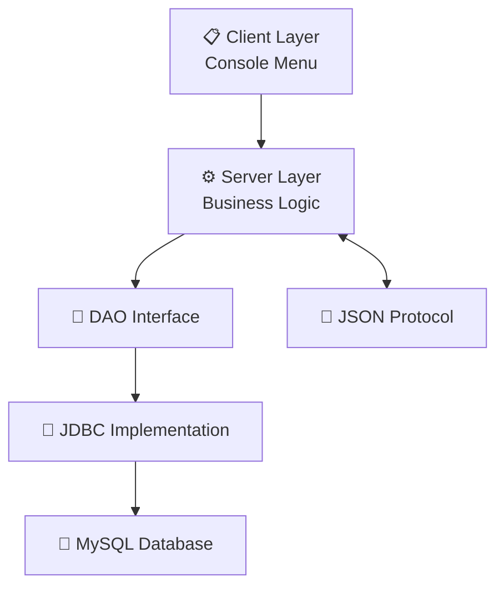

# 📚 Library Management System

## Stage 4 - Full Suite with Coverage

### 👥 Group Members
- **Abdihafid Gahayr** (D00283863)
- **Ali Jabril** (D00283862)

---

## 📋 Project Overview

The Library Management System is a client-server application that allows librarians to manage members, books, borrowing activities, and file attachments. The system supports full CRUD operations, JSON-based communication, multithreaded server, and binary file upload/download.

---

## 🏗️ System Architecture


```mermaid
graph TD
    Client["📋 Client Layer<br/>Console Menu"] --> Server["⚙️ Server Layer<br/>Business Logic"]
    Server --> DAO["📄 DAO Interface"]
    DAO --> JDBC["🔌 JDBC Implementation"]
    JDBC --> DB["💾 MySQL Database"]
    Server <--> JSON["🔄 JSON Protocol"]
```

---

# ✅ Features by Stage

## Stage 1: Core CRUD (F1-F9)

| Feature | Description | Status |
|---|---|---|
| F1 | Entity & Database Setup | ✅ |
| F2 | DAO Interface & JDBC | ✅ |
| F3 | Get All Members | ✅ |
| F4 | Get by ID (Optional) | ✅ |
| F5 | Delete by ID | ✅ |
| F6 | Insert with auto-generated ID | ✅ |
| F7 | Update Entity | ✅ |
| F8 | Filter with Predicate | ✅ |
| F9 | JSON Conversion | ✅ |

---

## Stage 2: Client-Server (F10-F16)

| Feature | Description | Status |
|---|---|---|
| F10 | Multithreaded Server | ✅ |
| F11 | ServerResponse Wrapper | ✅ |
| F12 | Get All / Get by ID | ✅ |
| F13 | Insert Entity | ✅ |
| F14 | Delete Entity | ✅ |
| F15 | Update Entity | ✅ |
| F16 | Error Handling & Protocol | ✅ |

---

## Stage 3: Binary Handling (F17-F22)

| Feature | Description | Status |
|---|---|---|
| F17 | Binary Schema (BLOB) | ✅ |
| F18 | File Upload | ✅ |
| F19 | File Download | ✅ |
| F20 | Metadata Query | ✅ |
| F21 | Disconnect Protocol | ✅ |
| F22 | Unit Tests | ✅ |

---

## Stage 4: Coverage (≥70%)

| Class | Coverage | Status |
|---|---|---|
| Member (domain) | 72% | ✅ |
| JdbcMemberDao (jdbc) | 80% | ✅ |
| JsonUtil (json) | 100% | ✅ |

---

# 📡 Client-Server Protocol

## Request Format

```json
{
  "requestType": "REQUEST_TYPE",
  "payload": {}
}
```

## Response Format

```json
{
  "status": "success",
  "message": "Operation completed",
  "data": {}
}
```

---

## Supported Request Types

| Request Type | Payload | Response |
|---|---|---|
| GET_ALL_MEMBERS | null | List<Member> |
| GET_MEMBER_BY_ID | {"id": 1} | Member |
| INSERT_MEMBER | {name, address, phone} | Member (with ID) |
| UPDATE_MEMBER | {id, name, address, phone} | Member |
| DELETE_MEMBER | {"id": 1} | null |
| UPLOAD | {entityId, fileName, contentType, fileSize, fileData} | Member |
| DOWNLOAD | {"id": 1} | {fileName, fileSize, fileData} |
| METADATA | {"id": 1} | {fileName, fileSize, hasImage} |
| DISCONNECT | null | null |

---

# 🗄️ Database Schema

## Member Table (with BLOB for F17)

```sql
CREATE TABLE member (
    id INT PRIMARY KEY AUTO_INCREMENT,
    name VARCHAR(100) NOT NULL,
    address VARCHAR(200) NOT NULL,
    phone VARCHAR(20) NOT NULL,
    file_name VARCHAR(255) DEFAULT '',
    content_type VARCHAR(100) DEFAULT '',
    file_size INT DEFAULT 0,
    profile_image LONGBLOB
);
```

---

# 🚀 How to Run

## Prerequisites

- Java 8 or higher
- MySQL (XAMPP)
- Maven

---

## 1. Start Database

```bash
# Start MySQL in XAMPP
# Import sql/mysqlSetup.sql in phpMyAdmin
```

---

## 2. Run Server

```bash
mvn exec:java -Dexec.mainClass=com.library.server.LibraryServer
```

---

## 3. Run Client

```bash
mvn exec:java -Dexec.mainClass=com.library.client.LibraryClient
```

---

## 4. Run Tests

```bash
mvn test
```

---

## 5. Run Coverage

```bash
# In IntelliJ: Right-click test folder → Run with Coverage
```

---

# 📁 Project Structure

```text
src/main/java/com/library/
├── client/
│   └── LibraryClient.java
├── server/
│   ├── LibraryServer.java
│   ├── ClientHandler.java
│   └── RequestDispatcher.java
├── dao/
│   ├── MemberDao.java
│   └── DaoRegistry.java
├── jdbc/
│   └── JdbcMemberDao.java
├── domain/
│   ├── Member.java
│   ├── Book.java
│   ├── Category.java
│   ├── Shelf.java
│   └── Staff.java
├── shared/
│   ├── ClientRequest.java
│   ├── RequestType.java
│   ├── ServerResponse.java
│   └── FileUploadPayload.java
├── json/
│   └── JsonUtil.java
└── db/
    └── DatabaseConnection.java

src/test/java/com/library/
├── domain/
│   ├── MemberTest.java
│   ├── BookTest.java
│   ├── CategoryTest.java
│   ├── ShelfTest.java
│   └── StaffTest.java
├── dao/
│   └── MemberDaoTest.java
└── json/
    └── JsonUtilTest.java
```

---

# 🧪 Test Results

## Test Summary

```text
JsonUtilTest: 9 tests passed
MemberDaoTest: 7 tests passed
MemberTest: 18 tests passed
BookTest: 8 tests passed
CategoryTest: 5 tests passed
ShelfTest: 5 tests passed
StaffTest: 6 tests passed

Total: 58 tests passed, 0 failures
```

---

## Coverage Results

| Class | Line Coverage | Required |
|---|---|---|
| Member | 72% | ≥70% ✅ |
| JdbcMemberDao | 80% | ≥70% ✅ |
| JsonUtil | 100% | ≥70% ✅ |

---

## Coverage Screenshot

```text
src/main/resources/reports/coverage.png
```

---

# 👥 Contribution Matrix

| Major Task | Primary Author | Contributor |
|---|---|---|
| Database schema + seed data | Ali | Abdihafid |
| DTO modelling + validation | Abdihafid | Ali |
| DAO interfaces + JDBC implementation | Abdihafid | Ali |
| Insert with auto-generated keys | Ali | Abdihafid |
| Predicate filtering (F8) | Ali | Abdihafid |
| JSON conversion (F9) | Abdihafid | Ali |
| Architecture diagram | Ali | Abdihafid |
| Multithreaded server (F10) | Abdihafid | Ali |
| ServerResponse<T> wrapper (F11) | Ali | Abdihafid |
| Protocol documentation | Abdihafid | Ali |
| Client CRUD operations | Abdihafid | Ali |
| Error handling (F16) | Ali | Abdihafid |
| Binary schema + BLOB (F17) | Abdihafid | Ali |
| File upload (F18) | Ali | Abdihafid |
| File download (F19) | Abdihafid | Ali |
| Metadata query (F20) | Ali | Abdihafid |
| Disconnect protocol (F21) | Abdihafid | Ali |
| Unit tests (F22) | Both | - |
| Coverage evidence | Ali | Abdihafid |
| Screencast | Abdihafid | Ali |
| README documentation | Both | - |

---

# 🎥 Screencast

<video controls src="Ali-CA2-opp.mp4" title="Title"></video>

### The screencast demonstrates:

- Server and client startup
- All menu options (1-8)
- CRUD operations
- File upload and download (F18, F19)
- Metadata query (F20)
- Two clients running simultaneously
- DISCONNECT protocol
- Running all tests

---

# 📚 References

- Jackson Databind - JSON serialization
- JUnit 5 - Unit testing framework
- MySQL Connector/J - JDBC driver
- https://github.com/nmcguinness/L8---OOP---Module-Content

---

# 🔗 GitHub Repository

https://github.com/AliJay2025/CA2-Library-DAO

---

# ✅ Submission Checklist

| Item | Status |
|---|---|
| All Stage 1-3 features implemented | ✅ |
| Unit tests passing (58 tests) | ✅ |
| Coverage ≥70% on required classes | ✅ |
| Coverage screenshot in /reports/coverage.png | ✅ |
| Screencast (8-10 minutes) | ✅ |
| README documentation complete | ✅ |
| Code pushed to GitHub | ✅ |

---

# 📅 Deadlines

| Stage | Deadline | Status |
|---|---|---|
| Stage 1 | Sunday 8th March | ✅ |
| Stage 2 | Sunday 22nd March | ✅ |
| Stage 3 | Sunday 26th April | ✅ |
| Stage 4 | Friday 8th May | ✅ |